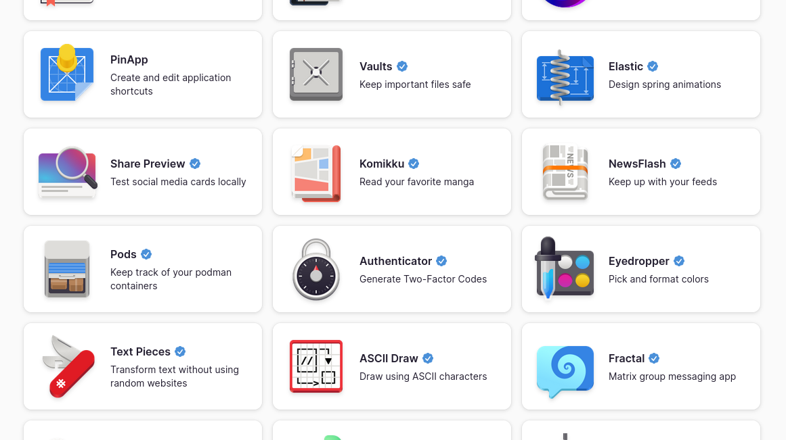
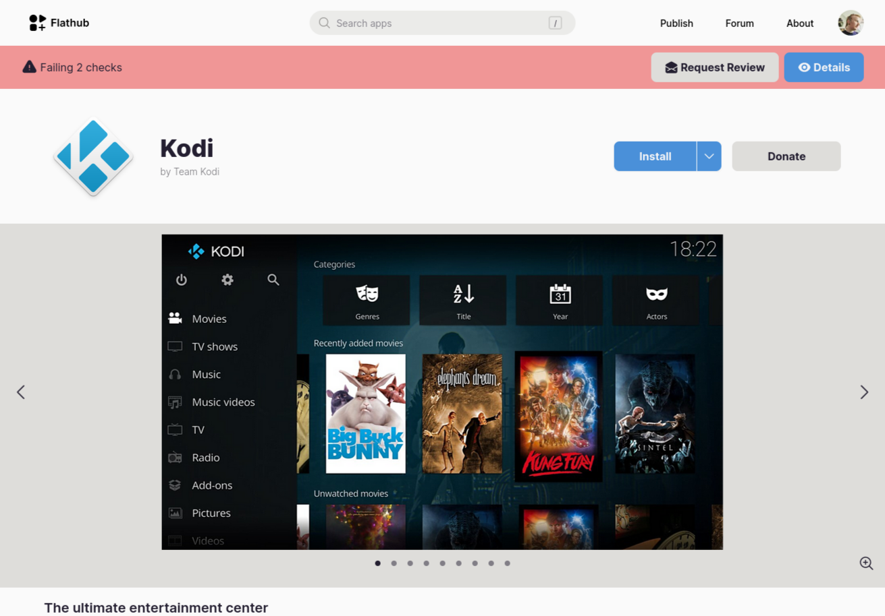
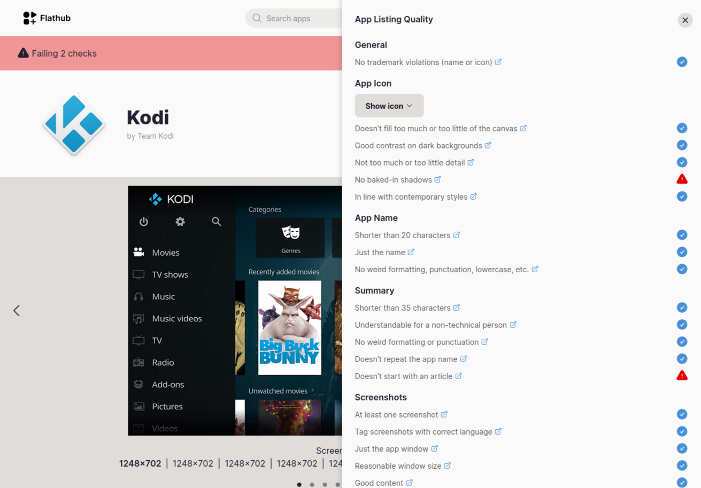
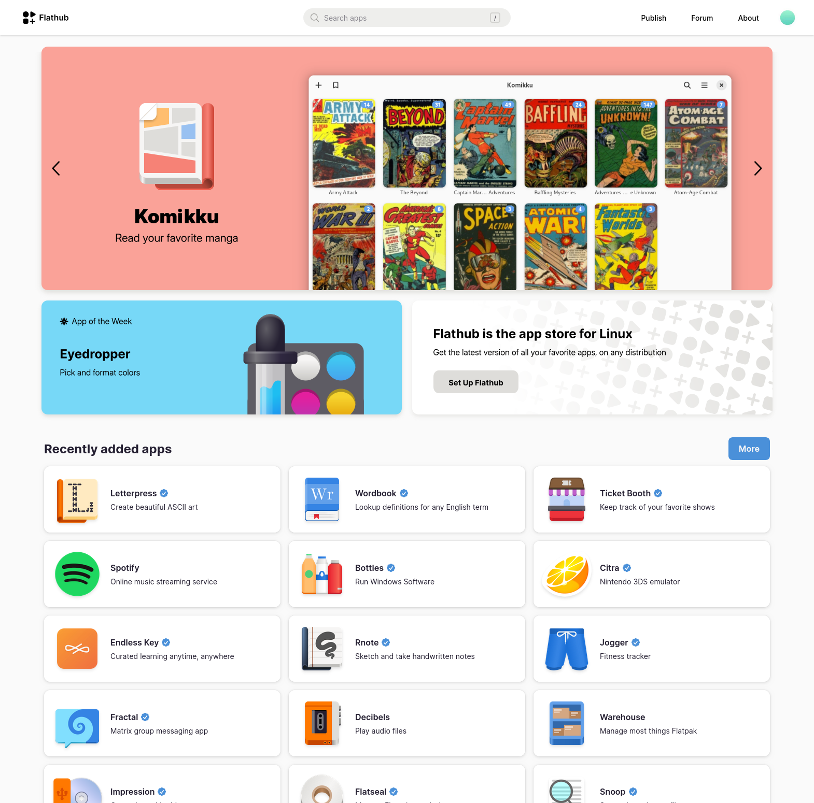

Flathub has grown massively over the past few years, with over 2400 apps at present. In the early days our goal was mostly to make it easy to get the latest version of popular apps via Flatpak. Today we can safely say that this goal has been achieved!

Not only can you get pretty much any app on Flathub, they are often directly maintained by the developer, and it's the primary channel many new app developers choose for shipping their apps.

## More Apps, More Problems
However, having lots of apps comes with some new (in this case nice to have) problems. While there are a lot of beautiful modern apps, there are also a lot of apps with low quality metadata, ugly icons, or out of date screenshots. This means that looking at the new and updated lists on the Flathub home page you get the impression that most of the apps on Flathub are low quality.

One of the biggest is probably that historically people were not discovering new apps from their repositories very often. Instead, they were mostly installing the same few classics with well-known brands (VLC, Blender, etc.), or relying on word of mouth for discovery. Now that new apps are being released on a weekly basis, app metadata becomes much more important for introducing people to these new apps.

The unfortunate result of the status quo in metadata quality is that many apps don't look inviting for new users, and it's difficult to find truly high quality apps among the rest.

So how can we make Flathub a place for people to discover awesome apps? We've thought about this quite a bit, and landed on a two-pronged approach:
1. Raise the bar for metadata for all apps
2. Introduce curation to hightlight the best apps

## Raising the Bar
As a first step towards improving metadata quality across the board we have added new, detailed [documentation for app metadata](https://docs.flathub.org/docs/for-app-authors/appdata-guidelines/quality-guidelines). This new page goes over all the most important aspects, and which common mistakes to avoid. These include, for example:

- App icons that fill the entire canvas
- Summaries repeating the app name
- Screenshots with no window shadow

We're also introducing a new review system for app metadata, where editors rate which of the criteria a specific app meets. As an app developer you can see the state of your metadata on the app page on Flathub.

If editors flagged issues with your app you can address them in the next release. Once the new release is on Flathub you can request a re-review. The status of your app will be updated accordingly.

If you are not an icon designer, getting your icon to meet the guidelines can be challenging. Luckily there are designers from the community you can ask for help! The [GNOME App Icon Design Matrix room](https://matrix.to/#/#appicondesign:gnome.org) is a good place to ask.

This does not affect the app review process for apps being published on Flathub. We will continue to accept apps that don't fully meet the new quality guidelines. However, we do want to highlight apps that meet the guidelines, and try to show them in more prominent places on the website.

## Curation
Our hope is that with better documentation and developer outreach we can get to a solid set of apps with high quality metadata: Short descriptions, good icons, correctly sized screenshots with good content, and so on. Once we have that, we have a lot of new possibilities with regard to curation. For example, we've been exploring having app banners with app icons and screenshots on the home page. Other ideas we'd like to experiment with in the future include curated lists of apps, seasonal/topical recommendations, and editorial blog posts.

Our current plan is to start off with some simple banners on the homepage and iterate from there. The moderation backend for this already exists, and we're planning on rolling out the fronted soon.

At this stage our focus is on the Flathub website, but of course eventually we want to make this data available to native app store clients as well.

This effort will also help to improve the flathub wide search and the discoverability and attractiveness of apps on flathub from the rest of the internet.

## What's Next?
As of today, if you have an app on Flathub you can log in on the website, and see the app metadata ratings for your apps. Please have a look at your apps' ratings and the new documentation and make sure your app's metadata is in shape when we start rolling out banners over the coming weeks :)

If you run into issues or have questions please contact us in [#flathub on Matrix](https://matrix.to/#/#flathub:matrix.org).

It's early days for all of this, but we're excited to continue working in this direction. Watch this space!
