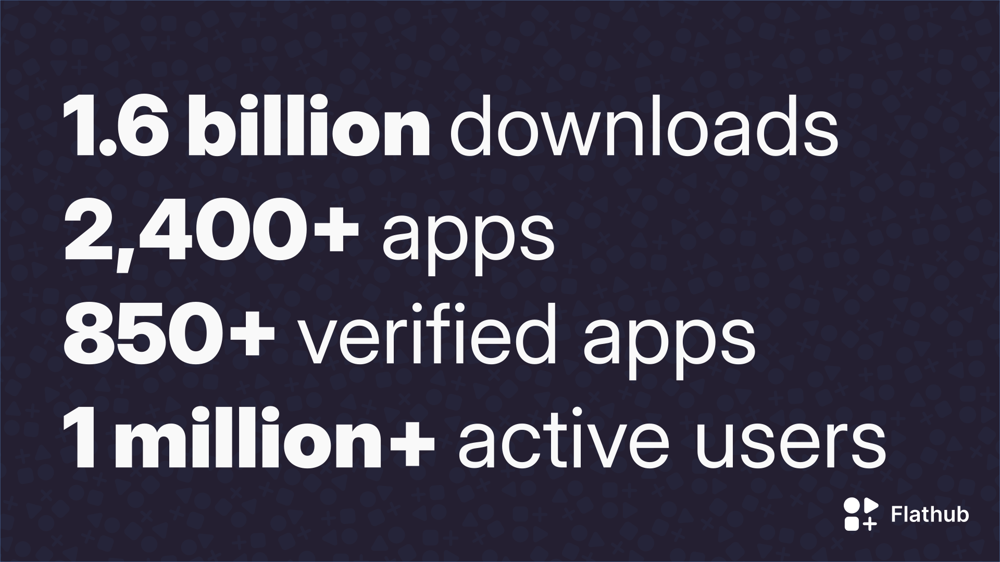

Earlier this month we shared [new app metadata guidelines](../2024-01-08/index.md) in response to the growth and maturity of Flathub. Today we're proud to share about that growth in a bit more detail including a huge milestone, how we calculate stats, and what we believe is driving that growth.

<!-- truncate -->

## Milestones

To date, Flathub has served a total of **1.6 billion downloads** of **over 2,400 apps** and their updates.

Since introducing [verified apps](/docs/for-users/verification) last year, **over 850 apps have been verified** by their original authors; more than one third of all apps, with that number constantly increasing.

And finally, we're thrilled to announce that Flathub has surpassed **one million active users**. 🎉️

## How We Measure Growth

We have a [public dashboard](https://flathub.org/statistics) that shares some basic statistics, powered by an [open source script](https://github.com/flathub-infra/flathub-stats). We don't track individual metrics from end user machines; instead, we look at downloads of specific artifacts from the Flathub infrastructure itself. This gives us a count of installs and updates over time, downloads per country (based on the origin of requests), and some derivative data like downloads of apps in different categories.

But how can we measure how many _active users_ we have?

Since Flathub necessarily serves downloads of Flatpak _runtimes_ (common platforms on which apps are built), we can estimate active users fairly well. For example, when installing or updating many apps, Flatpak will automatically install the base [FreeDesktop SDK](https://freedesktop-sdk.gitlab.io/) runtime on which the KDE and GNOME runtimes (and most other apps) are built. We can look at the number of downloads of _updates_ to a recent release of this runtime to estimate how many active installs are out there getting Flatpaks from Flathub.

This methodology reveals that over the past few months there have been over a million updates of each of the latest FreeDesktop SDK runtime releases, meaning we've passed the one million active user mark.

:::note
If anything, we believe this to be a conservative estimate as some users may be using apps that do not use the specific runtime measured.
:::

If you'd like to explore more of this data yourself, there's this [handy dashboard by Kristian Klausen](https://klausenbusk.github.io/flathub-stats/#ref=org.freedesktop.Platform/23.08&interval=infinity&downloadType=updates) ([source](https://github.com/klausenbusk/flathub-stats)), or you can always chat with us in [#flathub on Matrix](https://matrix.to/#/#flathub:matrix.org).

## What's Driving Growth

We attribute the growth of Flathub to a few developments over the years, and especially the last several months:

1. **Popular app availability**: Since we started Flathub, we've seen apps like [Firefox](https://flathub.org/apps/org.mozilla.firefox), [Google Chrome](https://flathub.org/apps/com.google.Chrome), [Discord](https://flathub.org/apps/com.discordapp.Discord), [VLC](https://flathub.org/apps/org.videolan.VLC), [Spotify](https://flathub.org/apps/com.spotify.Client), [Telegram](https://flathub.org/apps/org.telegram.desktop), [Microsoft Edge](https://flathub.org/apps/com.microsoft.Edge), [Steam](https://flathub.org/apps/com.valvesoftware.Steam), [OBS Studio](https://flathub.org/apps/com.obsproject.Studio), [Zoom](https://flathub.org/apps/us.zoom.Zoom), [Thunderbird](https://flathub.org/apps/org.mozilla.Thunderbird), and _many_ more make their way into the store. These are many of the apps people want and expect, especially if they're coming to a Linux desktop for the first time. Each time another popular app hits Flathub, it makes both Flathub and Linux that much more compelling to users.

2. **Verified apps**: We've heard that some folks have held off installing specific apps or even using Flathub altogether because they didn't want a third-party maintainer redistributing an app they rely on; [verifying apps](/docs/for-users/verification/) solves this by assuring users their favorite app is actually coming from its developer. With an ever-increasing number of [apps choosing to get verified](https://flathub.org/apps/collection/verified)—including both big names and many newer indie apps—the trust and adoption of Flathub increases.

3. **Steam Deck**: It's not [just a meme](https://mastodon.blaede.family/@cassidy/111031129234702967); we suspect Flathub being included as the default app source for the Steam Deck's desktop mode has had a large positive effect on the usage of Flathub. Just look at some of the [most popular apps](https://flathub.org/apps/collection/popular): retro game emulators, game compatibility tools, gaming-oriented chat services, alternate game launchers—all the kinds of apps you'd expect Steam Deck users to want. And in fact, "game" is the single most common category of app on Flathub. It turns out selling ["multiple millions" of devices](https://www.theverge.com/2023/11/9/23954205/valve-steam-deck-multiple-millions) has an impact on the ecosystem!

4. **Linux distro adoption**: In addition to shipping on Steam Deck, Flathub now comes included out of the box on at least Clear Linux, Endless OS, KDE Neon, Linux Mint, Pop!\_OS, and Zorin OS—and [as of Fedora 38](https://pagure.io/fesco/issue/2939), Flathub is available in its entirety when enabling third-party software sources. **Flathub is the preferred app store for Linux, and its grassroots adoption across the Linux desktop ecosystem proves that.**

5. **New apps**: Last but definitely not least, we've entered a thrilling chapter of Flathub as an ecosystem. It's not just another source to get popular, big-name apps you'd expect to be able to get anywhere else; **Flathub has become the preferred app store for a growing number of indie, open source developers**. Developers are increasingly submitting their own new apps and directing their users to Flathub; from [all 50+ GNOME Circle apps](https://circle.gnome.org/#apps) to apps like [Endless Key](https://flathub.org/apps/org.endlessos.Key), [Librum](https://flathub.org/apps/com.librumreader.librum), [Lightwave Explorer](https://flathub.org/apps/io.github.NickKarpowicz.LightwaveExplorer), [Live Captions](https://flathub.org/apps/net.sapples.LiveCaptions), and [Planify](https://flathub.org/apps/io.github.alainm23.planify), Flathub is the best way to get apps into the hands of Linux users.

And of course a large part of Flathub's continued growth has been due to the incredible work of the Flathub admins, contributors, and volunteers who have helped ensure Flathub remains the trustworthy and reliable service it has always been known as.

## Here's to What's Next!

It's easy to pat ourselves on the back for these milestones (and it's well deserved!), but equally important is to look forward. Over the coming months we're excited to continue tackling [the roadmap we laid out last year](https://discourse.flathub.org/t/flathub-in-2023/3808#whats-next-8), including continued work towards payments and the new organizational structure for Flathub.

We're also increasing our engagement with third-party developers and ISVs to share why they should bring their apps to the million-plus Flathub users on Linux, continuing to improve documentation, and working towards [curation and improved presentation of apps](../2024-01-08/index.md#curation). There's a lot more coming and always more to do; if you want to get involved, chat with us in [#flathub on Matrix](https://matrix.to/#/#flathub:matrix.org).

Thank you for reading, and happy downloading!
