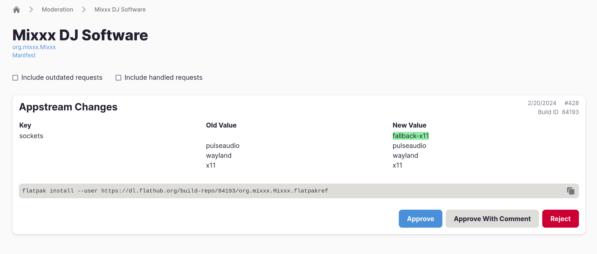

Flathub's automatic build validation is more thorough now, and includes checks for issues we would have previously flagged only manually. There is a chance that if your app has been passing the continuous integration checks previously, it will fail now.

<!-- truncate -->

If your application no longer passes the build validation stage in either Buildbot (for apps maintained on GitHub) or flat-manager (for direct uploads), make sure to look for specific messages in the log. Explanations for various error messages can be found in [the documentation][1]. If you are interested in running the linter locally or integrating it with your own CI, please refer to [the project page][2].

We have also started moderating some AppStream and all permission changes. If a build is modifying one of the critical AppStream fields such as application name, or adding/removing a static permission (as seen in the `finish-args` array in the manifest), it will be withheld for manual review. Reviewers may reject a build and reach out for clarification about the change.

Flathub has also switched to a modern AppStream library, commonly referred as libappstream. It enables developers to use all features described in the [AppStream 1.0 specification][3], including specifying supported screen sizes for mobile devices, or video snippets to accompany static screenshots. It also improves the validation of AppStream metadata. Many thanks to [Philip Withnall][4], [Luna Dragon][5] and [Hubert Figuière][6] for their work on this across the Flatpak stack, and [Matthias Klumpp][7] for implementing knobs needed by Flathub in the library itself.

While there was no prior heads-up about the validation changes, we were focused on closing the gaps which were allowing potentially broken builds to be published. Any future breaking changes will be properly announced on this blog, and we will also separately inform maintainers of the affected applications about required changes.

[1]: https://docs.flathub.org/docs/for-app-authors/linter/
[2]: https://github.com/flathub-infra/flapak-builder-lint
[3]: https://www.freedesktop.org/software/appstream/docs/
[4]: https://tecnocode.co.uk/
[5]: https://nullrequest.com/
[6]: https://www.figuiere.net/hub/
[7]: https://blog.tenstral.net/
