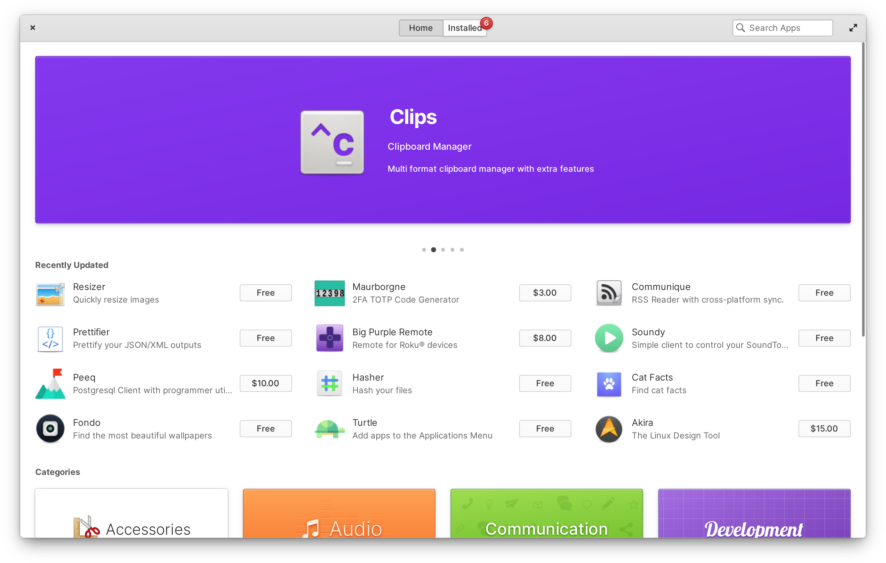

We're gearing up to launch curated banners on the Flathub home page! However, before we can do that there's one more blocker: Banners need a background color for each app, and many apps don't provide this metadata yet. This is why today we're expanding our MetaInfo quality guidelines and quality checks on the website; please add these colors to your app's MetaInfo file today using the `<branding/>` appstream tag, and read on to learn more about brand colors.

<!-- truncate -->

## What are brand colors?

App brand colors are an easy and effective way for app developers to give their listing a bit more personality in app stores. In combination with the app icon and name, they allow setting a tone for the app without requiring a lot of extra work, unlike e.g. creating and maintaining additional image assets.


## Why now?

This idea was first implemented in elementary AppCenter, and later standardized as part of the AppStream specification.

While it has been in AppStream itself [for a few years](https://github.com/ximion/appstream/issues/187), it was unfortunately not possible for Flathub's backend to pick it up until the recent [port to libappstream](../2024-02-21/index.md). This is why many apps are still not providing this metadata -- we have not been able to make use of it until now.



Now that we can finally pick these colors up from AppStream MetaInfo files, we want to make use of them—and they are essential for the new banners.

## Adding brand colors

Apps are expected to provide two different brand colors for light and dark. [Here's an example](https://github.com/pika-backup/pika-backup/blob/8f2f04a1a27d2b04db48f7dbf26577009ff39be3/data/app.metainfo.xml.in#L44) of a MetaInfo file in the wild including brand colors.

This is the snippet you need to include in your MetaInfo file:

```xml
<branding>
  <color type="primary" scheme_preference="light">#faa298</color>
  <color type="primary" scheme_preference="dark">#7f2c22</color>
</branding>
```

In choosing the colors, try to make sure the colors work well in their respective context (e.g. don't use a light yellow for the dark color scheme), and look good as a background behind the app icon (e.g. avoid using exactly the same color to maintain contrast). In most cases it's recommended to pick a lighter tint of a main color from the icon for the light color scheme, and a darker shade for the dark color scheme. Alternatively you can also go with a complementary color that goes well with the icon's colors.


## What's next?

Today we've updated the MetaInfo quality guidelines with [a new section on app brand colors](https://docs.flathub.org/docs/for-app-authors/metainfo-guidelines/quality-guidelines/#brand-colors). Going forward, brand colors will be required as part of the MetaInfo quality review.

If you have an app on Flathub, check out the guidelines and update your MetaInfo with brand colors as soon as possible. This will help your app look as good as possible, and will make it eligible to be featured when the new banners ship. Let's make Flathub a more colorful, exciting place to find new apps!
