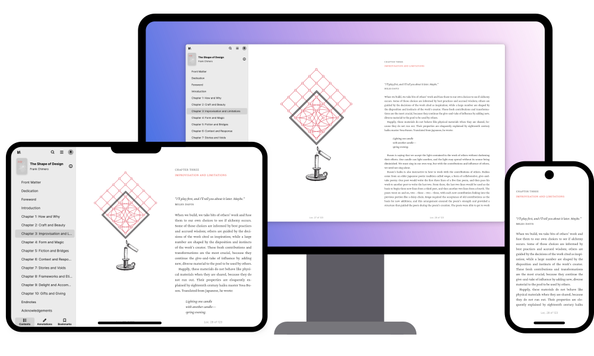

With apps made for different form factors, it can be hard to find what works for your specific device. For example, we know it can be a bit difficult to find great apps that are actually designed to be used on a mobile phone or tablet. To help solve this, we’re introducing a new collection: On the Go.

<!-- truncate -->

[ ][collection]

As the premier source of apps for Linux, Flathub serves a wide range of people across a huge variety of hardware: from ultra powerful developer workstations to thin and light tablets; from handheld gaming consoles to a growing number of mobile phones. Generally any app on Flathub will work on a desktop or laptop with a large display, keyboard, and mouse or trackpad. However, devices with only touch input and smaller screen sizes have more constraints.

## Revealing the App Ecosystem

Using [existing data][documentation] and open standards, we’re now highlighting apps on Flathub that report as being designed to work on these mobile form factors. This new [On the Go collection][collection] uses existing device support data submitted by app developers in their MetaInfo, the same spec that is used to build those app’s listings for Flathub and other app store clients. The collection is featured on the Flathub.org home page for all devices.

Many of these apps are adaptive across screen sizes and input methods; you might be surprised to know that your favorite app on your desktop will also work great on a Linux phone, tablet, or Steam Deck’s touch screen. We aim to help reveal just how rich and well-rounded the app ecosystem already is for these devices—and to give app developers another place for their apps to shine and be discovered.

## Developers: It’s Up to You

As of this writing there are over 150 apps in the collection, but we expect there are cases where app developers have not provided the requisite device support data.

If you’re the creator of an app that should work well on mobile form factors but isn’t featured in the collection, take a minute to double-check the [documentation] and your own apps’s MetaInfo to ensure it’s accurate. Device support data can also be used by native app store clients across form factors to determine what apps are displayed or how they are ranked, so it’s a good idea to ensure it’s up to date regardless of what your app supports.

[collection]: https://flathub.org/apps/collection/mobile/
[documentation]: https://docs.flathub.org/docs/for-app-authors/metainfo-guidelines/#device-support
