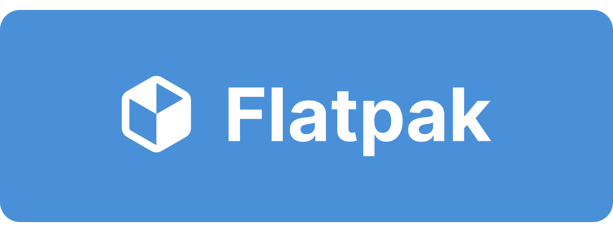

With thousands of apps and billions of downloads, Flathub has a responsibility to help ensure the safety of our millions of active users. We take this responsibility very seriously with a layered, in-depth approach including sandboxing, permissions, transparency, policy, human review, automation, reproducibility, auditability, verification, and user interface.

<!-- truncate -->

Apps take a long journey from a developer’s source code to being used on someone’s device; let’s take a look at that journey from a perspective of safety.

## Flatpak Security & Sandboxing

Each app on Flathub is distributed as a [Flatpak](https://flatpak.org/). This app packaging format was specifically designed with security and safety at its core, and has been continuously improved over the past decade. It has received endorsements, development, and wide adoption from organizations such as Bambu Lab, Bitwig, CodeThink, Collabora, Discord, The Document Foundation, elementary, Endless, GDevelop, KiCad, Kodi, GNOME, Intel, KDE, LibreOffice, Mozilla, OBS Studio, Plex, Prusa Research, Purism, Red Hat, System76, Telegram, Valve, and many more.

From a technical perspective, Flatpak does not require elevated privileges to install apps, isolates apps from one another, and limits app access to the host environment. It makes deep use of existing Linux security technologies such as cgroups, namespaces, bind mounts, and seccomp as well as [Bubblewrap](https://github.com/containers/bubblewrap) for sandboxing.

Flatpak apps are also built from a declarative manifest, which defines the exact sources and environment to build from to enable as much reproducibility as possible.

Due to Flatpak’s sandboxing, apps don’t have permission to access to many aspects of the host OS or user data they might need. To get that access, apps must request it using Portals or static permissions.

### Portals & Static Permissions

Most permissions can be requested and granted on demand via an API called [Portals](https://flatpak.github.io/xdg-desktop-portal/docs/). These permissions do not need to be given ahead of time, as desktop environments provide the mechanisms to give user consent and control over them e.g. by indicating their use, directly prompting the user before the permission is granted, and allowing revocation.

Portals include APIs for handling auto-start and background activity; access to the camera, clipboard, documents, files, location, screen casting, screenshots, secrets like passwords, trash, and USB devices; setting global shortcuts; inhibiting suspend or shut down; capturing input; monitoring memory, network, or power profiles; sending notifications; printing; setting a wallpaper; and more. In each case, the user’s desktop environment (like GNOME or KDE) manages if and how a user is notified or prompted for permissions—and if the permission is not granted, the app must handle it gracefully.

Apps must also define any [static permissions](https://docs.flatpak.org/en/latest/sandbox-permissions.html) they need to function. These are clearly defined up front and include access to resources such as the network, Bluetooth, and audio devices. For regular file handling such as opening or saving, apps can use the File Chooser portal. In some cases apps may only make sense with permanent access to specific a folder, in which case a narrowly-scoped static permission (e.g. read-only access to the user’s Music folder) may be used.

Static permissions are designed to be as narrowly-scoped as possible and are unchanging per release of an app. They are not designed to be modified by an end user except in cases of development, debugging, or [reducing permissions](https://docs.flathub.org/docs/for-users/permissions). Due to this, Flatpak always prefers apps to use Portals over static permissions whenever possible.

### Shared Runtimes & Modules

Every app is built against a [Flatpak runtime](https://docs.flatpak.org/en/latest/basic-concepts.html#runtimes) hosted by Flathub. The runtimes provide basic dependencies, are well-maintained by the Linux community, and are organized according to various platforms a developer may target; for example, GNOME, KDE, or a generic FreeDesktop SDK. This means many apps—especially those targeting a platform like GNOME or KDE and using its developer libraries—don’t need to pull in external dependencies.

Runtimes are automatically installed with apps that require them, and are updated separately by the user’s OS, app store, or CLI when needed. When a dependency in a runtime is updated, e.g. for a critical security update, it rolls out as an update to all users of apps that use that runtime.

In some cases there are commonly-used libraries not provided directly by one of the available runtimes. Flathub provides [shared modules](https://docs.flathub.org/docs/for-app-authors/shared-modules) for these libraries to centralize the maintenance, as well as automated tooling to propose updating these libraries in apps.

## Submission & Human Review

Once an app is developed, it must be submitted to Flathub for consideration to be hosted and distributed. At this stage, humans from Flathub review the app to ensure it follows the [requirements](https://docs.flathub.org/docs/for-app-authors/requirements). Of note:

- **Apps must be sandboxed Flatpaks with narrow permissions**, including using appropriate runtime permissions instead of broad static permissions whenever possible.

- **Apps must not be misleading or malicious**, which covers impersonating other apps or including outright malicious code or functionality.

- **App IDs must accurately reflect the developer’s domain name** or code hosting location; e.g. if an app is submitted that purports to be Lutris, its ID must be obviously associated with that app (in this case, [Lutris.net](https://lutris.net)).

Each of the documented requirements are checked—and if a reviewer finds something out of place they request changes to the submission, ask for rationale, or reject it completely.

## Automated Testing

In addition to human review, Flathub also makes use of automated testing for a number of quality and safety checks. For example, our automated tests block unsafe or outright wrong permissions, such as apps requesting access to session or system busses or desktop environment namespaces. Our automated tests also help ensure reproducible builds by disallowing pointing at bare git branches without a specific commit and/or tag specified.

## Reproducibility & Auditability

Once an app has been approved and passes initial tests, it is built using the open source and publicly-available flatpak-builder utility from the approved public manifest, on Flathub’s infrastructure, and without network access. Sources for the app are validated against the documented checksums, and the build fails if they do not match.

For further auditability, we insert the git short rev into the Flatpak build subject so anyone can confirm which commit of the manifest repo a specific build was built from. The build itself is signed by Flathub’s key, and Flatpak/OSTree verify these signatures when installing and updating apps.

We mirror the exact sources each app is built against in case the original source goes down or there is some other issue, and anyone can build the Flatpak back from those mirrored source to reproduce or audit the build. The manifest used to build the app is distributed to every user in the app’s sandbox at `/app/manifest.json`, which can be inspected and used to rebuild the app exactly as it was built by Flathub.

## Verification

Apps can be [verified](https://docs.flathub.org/docs/for-app-authors/verification) on Flathub; this process confirms that an app is published by the original developer or an authorized party by proving ownership of the app ID. While all apps are held to the same high standards of safety and review on Flathub, this extra layer helps users confirm that the app they are getting is _also_ provided or authorized by its developer.

Over half of the apps on Flathub so far are verified, with the number regularly increasing.

## App Store Clients

Once an app is developed, submitted, tested, approved, built, and distributed, it appears in app store clients like Flathub.org, KDE Discover, GNOME Software, and elementary AppCenter—as well as the Flatpak CLI. While exact implementations vary and the presentation is up to the specific app store client, generally each will show:

- Static permissions and their impact on safety
- Open Age Rating Service rating and details
- If an app uses outdated runtimes
- Release notes for each release
- If static permissions increase between releases

Flathub.org and GNOME Software also display the app’s verified status.

## Updates

Once an app is accepted onto Flathub, it’s not just the wild west; there are still a number of safety protections built into the flow:

- **Flathub maintains ownership over the manifest repo**, while app developers are invited as limited collaborators
- **The manifest’s default branch is protected**, preventing direct pushes without a pull request
- **The manifest’s commit history cannot be rewritten**, making it harder to sneak something in
- **Flathub’s automated tests must pass** before a PR can be merged and an update can be pushed
- **Static permission changes are held for human review** before an update is released to users
- **Critical MetaInfo changes are held for human review**, e.g. if an app name, developer name, app summary, or license changes

## Caveats

There are a few caveats to some of the points above which I would be remiss not to mention.

First, Flathub has granted a small handful of trusted partners (including Mozilla and OBS Studio) the ability to directly upload their builds from their own infrastructure. These projects have an entire CI pipeline which validates the state of their app, and they perform QA before tagging the release and pushing it to Flathub. Even for these few cases of direct uploads, we require a public manifest and build pipeline to enable similar reproducibility and auditability as outlined above. We also require the apps to be verified, and still run automated tests such as our linter against them.

Lastly, some apps (around 6%) use [extra-data](https://docs.flatpak.org/en/latest/conventions.html#exporting-through-extra-data) to instruct Flatpak to download and unpack an existing package (e.g. a Debian package) during installation. These are largely proprietary apps that cannot be built on Flathub’s infrastructure, or apps using complex toolchains that require network access during build. This is discouraged since it does not enable the same level of auditability nor multi-architecture support that building from source does. As a result, this is heavily scrutinized during human review and only accepted as a last resort.

Even with the above, the vast majority of apps are built reproducibly from source on Flathub’s infrastructure—and the handful that aren’t still greatly benefit from the transparency and auditability built into all of the other layers.

## Incident Response

While we expect to catch the vast majority of safety issues with the above, we are also able to respond to anything that may have slipped through. For example, we have the ability to quickly drop an app from the remote in case we find it’s malicious; we can also revert, drop, or veto changes made to apps.

We take security reports and legal issues very seriously; please [contact the Flathub admins](mailto:admins@flathub.org) to report an issue, or [chat with us on Matrix](https://matrix.to/#/#flathub:matrix.org).

---

## In Summary…

As you can see, Flathub takes safety very seriously. We’ve worked with the greater Linux and FreeDesktop ecosystem for _over a decade_ on efforts such as Flatpak, OSTree, Portals, and even desktop environments and app store clients to help build the best app distribution experience—for both users and app developers—with safety as a core requirement. We believe our in-depth, multi-layered approach to safety has set a high bar that few others have met—and we will continue to raise it.

Thank you to all of the contributors to Flatpak, Flathub, and all of the technologies our ecosystem depends on for supporting us. Thank you to the developers of thousands of apps for entrusting us with the distribution of your apps to users. And as always, thank you to the millions of users trusting Flathub as your source of apps on Linux. ♥
