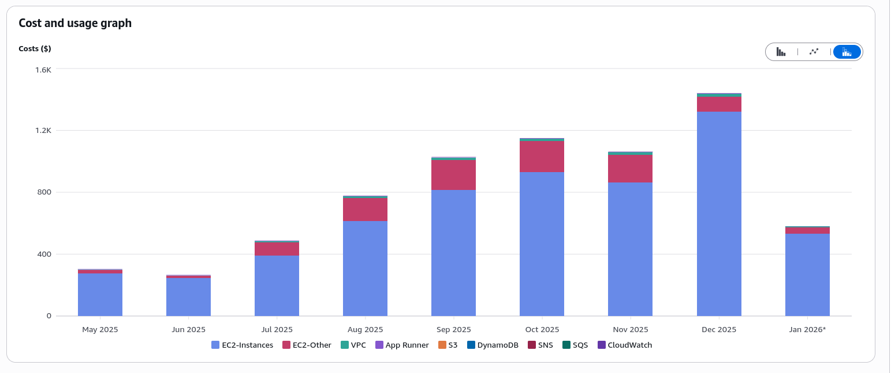

We are approaching 1 year since the switch to Vorarbeiter for building and
publishing apps. In this time, we have made several improvements it's time to
brag about.
<!-- truncate -->
## RunsOn

In the initial announcement, I mentioned we are using [RunsOn][runson], a
just-in-time runner provisioning system, to build large apps such as Chromium.
Since then, we have fully switched to RunsOn for all builds. Free GitHub runners
available to open source projects are heavily overloaded and there are limits on
how many concurrent builds can run at a time. With RunsOn, we can request an
arbitrary amount of threads, memory and disk space, for less than if we were
to use paid GitHub runners.

We also rely more on spot instances, which are even cheaper than the usual on
demand machines. The downside is that jobs sometimes get interrupted, but to avoid
spending too much time on the retry ping-pong, retried builds use the on-demand
instances from the get-go. The same catch applies to large builds, which are unlikely
to finish in time before spot instances are reclaimed.

The cost breakdown since May 2023 is as follows:

Once again, we are not actually paying for anything thanks to the [AWS credits
for open source projects program][aws]. Thank you RunsOn team and AWS for
making this possible!

## Caching

Vorarbeiter now supports caching downloads and ccache files between builds.
Everything is an OCI image if you are feeling brave enough, and so we are
storing the per-app cache with [ORAS][oras] in GitHub Container Registry.

This is especially useful for cosmetic rebuilds and minor version bumps, where
most of the source code remains the same. Your mileage may vary for anything more
complex.

## End-of-life without rebuilding

One of the Buildbot limitations was that it was difficult to retrofit pull requests
marking apps as end-of-life without rebuilding them. Flat-manager itself exposes
an API call for this since 2019 but we could not really use it, as apps had to
be in a buildable state only to deprecate them.

Vorarbeiter will now detect that a PR modifies only the end-of-life keys in the
`flathub.json` file, skip test and regular builds, and directly use the
flat-manager API to republish the app with the EOL flag set post-merge.

## Web UI

GitHub's UI isn't really built for a centralized repository building other
repositories. My love-hate relationship with Buildbot made me want to have a
similar dashboard for Vorarbeiter. 

The new web UI uses PicoCSS and HTMX to provide a tidy table of recent builds.
It is unlikely to be particularly interesting to end users, but kinkshaming is
not nice, okay? I like to know what's being built and now you can too
[here][webui].

## Reproducible builds

We have started testing binary reproducibility of x86_64 builds targetting the
stable repository. This is possible thanks to [flathub-repro-checker][frc], a
tool doing the necessary legwork to recreate the build environment and compare
the result of the rebuild with what is published on Flathub.

While these tests have been running for a while now, we have recently restarted them
from scratch after enabling S3 storage for diffoscope artifacts. The current
status can be viewed on [the new vorarbeiter's web UI][reprowebui].

Failures are not currently acted on. When we collect more results, we may
start to surface them to app maintainers for investigation. We also don't test
direct uploads at the moment.

[runson]: https://runs-on.com/
[aws]: https://aws.amazon.com/blogs/opensource/aws-promotional-credits-open-source-projects/
[oras]: https://oras.land/
[frc]: https://github.com/flathub-infra/flathub-repro-checker
[webui]: https://builds.flathub.org/
[reprowebui]: https://builds.flathub.org/reproducible
