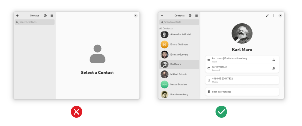

# Quality guidelines

:::tip
Please [open an issue](https://github.com/flathub/flathub/issues/new?assignees=&labels=&projects=&template=1-quality-mod.md&title=Quality+guideline+problems+for+%3Capp+name%3E) using the Quality Guidelines template for support
regarding these guidelines.
:::

The following guidelines are not required for submission to Flathub,
but are best practices we recommend and consider for curation and
promotion. These guidelines are designed to help your app and Flathub
itself appear in the best light to users. The guidelines may change over
time based on developer and user feedback.

The term `must` in these guidelines is used in the context of considering
whether an app passes the app listing quality checks. Apps that do not
follow these guidelines may still be published on Flathub.

For the basics on how to write metadata for your app, see the
[MetaInfo Guidelines](/docs/for-app-authors/metainfo-guidelines).

### Benefits of passing quality checks

Passing the quality checks enhances an application's visibility
on the Flathub homepage. Applications that meet _all_ the checks can be
featured prominently on the weekly banner and "App of the Day"
highlights on a rotational basis. The more guidelines an application
meets, the higher its chances of being featured in the trending section
of flathub.org. Additionally, some Linux distributions and software
centres may use the list of approved apps to curate their own featured
selections.

These benefits may evolve as we explore new ways for enhanced curation
and promotion.

## General

### No trademark violations

Please see the policy in the [requirements section](/docs/for-app-authors/requirements#no-trademark-violations).

### Runtime not end-of-life

Your app must target a runtime that is not end-of-life (EOL). This means you should not use deprecated or obsolete runtimes, as they may not receive security updates or support.

Check [Runtimes](/docs/for-app-authors/runtimes) for runtime support periods and expected eol dates.

### Managed by app author

Use Flathub verification to indicate that you are the author of the app
and that you are managing the app on Flathub.

## Brand colors

### Has primary brand colors

Apps should set two primary [brand colors](/docs/for-app-authors/metainfo-guidelines/#brand-color),
`light` and `dark`.

For example:

```xml
<branding>
  <color type="primary" scheme_preference="light">#faa298</color>
  <color type="primary" scheme_preference="dark">#7f2c22</color>
</branding>
```

### Good brand colors


Brand colors are often used as a background behind the app icon, so
make sure the colors are not too similar to the app icon in order to
ensure good contrast. Avoid using light colors for the dark variant, or
the same color for both dark and light. In most cases the dark variant
should be a darker, more muted version of the light brand color. Do not
use the same color for the dark and light variants.

Brand colors should be **colorful**. In particular, avoid white (or very
light grays) and black (or very dark grays).

When choosing brand colors, a good starting point is using a
lighter/darker version of the primary color used in the icon (though be
careful to maintain good contrast with the icon), or a complementary
color that pairs well with the main icon color (e.g. blue if the icon
is yellow).

It's recommended to consider the brand colors an extension of the app
icon, and have the icon designer choose them when making the icon.


Feel free to play with our [banner preview](/banner-preview) to find
your favorite colors.

## App Icon

### Icon size

The icon should be SVG, or a PNG with a size greater or equal to
256x256 pixels. It has to be square.

### Reasonable footprint

The icon shouldn't fill too much or too little of the canvas. Avoid
filling the entire canvas and having the icon touch the edges of the
canvas (except with small protruding elements). Similarly, avoid thin
shapes that are hard to see.

You can use our icon grid (<a href="pathname:///img/app-icon-grid.svg" download>SVG
template download</a>) with square and circular base shapes to check if
your icon's footprint is too large or too small. The examples below
show the grid overlaid on some app icons. The first icon fills too much
of the icon grid and extends beyond the grid and the second icon fills
too little of the icon grid due to the transparency, so they don't pass
this guideline.


### Good contrast

The icon should have good contrast on dark and light backgrounds. In
particular, avoid single-color glyphs and the like since they can be
very hard to see if the background color is similar. Dark colors near the
edges are also a problem since shadows don't help much with contrast on
dark backgrounds.


### Not too much or too little detail

The icon should be recognizable in small sizes. Avoid too many tiny
details and small text, and generally try and match other well-executed
app icons in terms of complexity. Icons should also be complex enough to
be recognizable, e.g. a flat single-colored symbol is too simple.


### No baked-in shadows

The icon should not have any baked-in shadows or glows. Both the
Flathub website and native stores apply a shadow to all icons, so
baked-in shadows result in double shadows or other glitches.

### In line with contemporary styles

The icon should be somewhat in line with the contemporary icon styles
(i.e. not look like it hasn't been updated in decades). The [GNOME](https://developer.gnome.org/hig/guidelines/app-icons.html)
and [KDE](https://develop.kde.org/hig/style/icons/colorful/application/)
app icon guidelines are examples of the kind of style your icon should
align with.


In some cases, it can make sense for the icon to align with the visuals
of the app, rather than contemporary icon styles (especially relevant for
games). This can be accommodated by embedding the custom style icon in
one of the grid shapes, e.g. a square or circle. This way the unique
style is preserved, but the icon's size and shape are in line with other
apps.

## App Name

### Not too long

The [name](/docs/for-app-authors/metainfo-guidelines/#name-and-summary)
should ideally, be no longer than 15 characters, and must be shorter than
20 characters.

:::danger Bad examples

- Apostrophe Markdown
- Minimal Markdown Editor
  :::

### Just the name

The name should be just a short name, without any additional
information. For example, don't append what the app does or is used for
to the name; use the summary to provide this information instead.

:::danger Bad examples

- Krita - Digital Painting, Creative Freedom
- Fractal (Matrix Client)
- Apostrophe: the best free Markdown editor
- Firefox Web Browser
  :::

:::tip Good examples

- Krita
- Fractal
- Apostrophe
- Firefox
  :::

If the app is distinct among different versions of your app on Flathub
(e.g. `Firefox Beta` versus the standard `Firefox`), then using the full
name including the edition may be acceptable.

### No weird formatting

App names should avoid nonstandard formatting and punctuation. For
example, avoid all-lowercase, all-uppercase, camel/pascal case, and
punctuation like dashes or periods.

:::danger Bad examples

- krita
- FRACTAL
- ApostropheEditor
- Firefox.org
  :::

Cases where the formatting is part of an established brand may be
exempt (e.g. `VLC`).

## Summary

### Not too long

The [summary](/docs/for-app-authors/metainfo-guidelines/#name-and-summary)
should ideally be between 10 and 25 characters, and no longer than 35
characters.

:::tip Good example

- Write markdown in style
  :::
  :::danger Bad example

- Simple, easy-to-use, distraction-free markdown editor written in
  Python
  :::

### Not technical

The summary should be understandable by a non-technical person, and not
contain any technical terms. Don't mention the toolkit, programming
language, or other implementation details that would not be relevant to
a non-developer and explain what the app does for people instead. Don't
duplicate metadata that's already available in a different form, such as
the license, e.g. by mentioning that the app is "free and open source".
Avoid generic nouns like "app", "tool", or "client".

:::danger Bad examples

- GTK4 chat app written in Rust
- An Electron Wrapper for the Telegram Web App
- Free and open source Qt5 Matrix client
  :::

:::tip
There are separate fields for technical information. If you want to
mention the toolkit do it in [keywords](https://www.freedesktop.org/software/appstream/docs/chap-Metadata.html#tag-keywords).
:::

### No weird formatting

The summary should not have any weird formatting or punctuation. It
should use sentence case, rather than title case. It shouldn't end with
a full stop.

:::danger Bad example

- A Simple Markdown Editor.
  :::

### Don't repeat the name

The summary is usually shown next to the app name, so repeating the name
looks bad.

:::danger Bad example

- Apostrophe - A simple markdown editor
  :::

### Don't start with an article

Starting summaries with an article is almost always unnecessary. Instead,
either omit the article or ideally phrase it in the imperative with a
verb.

:::danger Bad examples

- An image viewer
- The LibreOffice suite
  :::

:::tip Good examples

- View images and videos
- Edit documents
  :::

## Description

### Don't repeat the summary

The [description](/docs/for-app-authors/metainfo-guidelines/#description)
should not just repeat or rephrase the summary. The summary is a kind
of slogan or advertisement for the app, while the description should go
into more detail about the purpose of the app, which features it has, and
what makes it unique.

### Not too short

The description should be substantially longer than the summary.
Something like 3-6 lines of text at default line widths
(around 70 characters) is a good length for most apps, for very large
apps up to about 10 lines.

### No super long lists

Avoid feature lists with more than 10 items, they are difficult to scan
and make the app store listing unwieldy. Instead, try to group points or
use paragraphs instead of bullet points.

## Screenshots

### At least one screenshot

Apps should have at least one [screenshot](/docs/for-app-authors/metainfo-guidelines/#screenshots)
in English. For medium-complexity apps, 3-6 is a good range, for very
large apps with lots of screens 6-10 is appropriate. More than 10 is
probably too many.

:::tip
Your best screenshot should be in the first position because it will be
the first thing a user sees when viewing your app on Flathub.

We might also use this in other places, such as featured banners, so
make sure it's a good one.
:::

### Tag screenshots with the correct language

Screenshots should be tagged with the [language](/docs/for-app-authors/metainfo-guidelines/#metainfo-translations)
they are in. For example, if you have a screenshot of the app in German,
tag it with `xml:lang="de"`.

### Just the app window

Use the "window screenshot" feature in your native system screenshot
tool to get just the app window and its shadow. Do not include the
wallpaper behind the app or even the entire desktop. Do not edit the
screenshot, crop it, add text, or include promotional graphics.


### Take screenshots on Linux

Do not use screenshots taken on other platforms, especially if it's
immediately obvious from window controls and the like.

### Default settings

Use the platform default configuration for all settings that affect
screenshots, including window controls, interface font, large text,
high contrast, dark style, accent color, and so on. Having some
screenshots to show off that e.g. dark style is supported is fine, but
these should not be the only screenshots.


### Include window shadow and rounded corners

Screenshots must include the native decoration such as any title bar,
window shadows, and rounded corners. App stores do not add a shadow after
the fact, and without one, screenshots can look glitchy or have low
contrast depending on the background. Apps that are always fullscreen
(such as most games) are exempt from this, but in these cases, all
screenshots must be fullscreen. Do not use a mix of windowed and
fullscreen screenshots.

:::tip
Don't maximize your app window when taking screenshots, since this will
remove the shadow and rounding.
:::

### Reasonable window size

In order to ensure that text and interface elements are visible scaled
down in the app store UI the window size should be 1000x700 pixels or
smaller (2000x1400 for HiDPI).


### Image captions

Every screenshot should have a [caption](https://www.freedesktop.org/software/appstream/docs/chap-Metadata.html#tag-screenshots)
briefly describing it. Captions should only be one sentence and not end
with a full stop. Don't start them with a number.

### Good content

Screenshots of apps that display content (media viewers, notes apps,
chat, social media, and the like) should not show empty states or ugly
content. Take some time to select high-quality content, it makes all the
difference for screenshots.



### Up to date

Screenshots should reflect the current state of the app's interface, not
some previous version. If an app update makes visible changes to the
interface, screenshots should be updated at the same time.

This also applies to changes in the environment's default window
decoration layout.

## Release Notes

### Release notes for every release

Make sure all your releases have [release notes](/docs/for-app-authors/metainfo-guidelines/#release),
even minor ones.

### Short but informative

Release notes should not be too long, and focus on briefly explaining
what changed from a user perspective. 2-3 sentences for medium-sized
releases is a good length. For larger releases, avoid endless bullet
point lists and rather go with a few paragraphs or a shorter summarized
list instead.

### No "bug fixes and performance improvements"

Release notes should include some actual information about what changed
rather than just a generic boilerplate.

## Age Ratings

### Take easily accessible content into account

Apps acting as "readers" or "stores" for external content should take
into account what is accessible by just navigating around in the app. If
content of a certain type can be arrived at without searching or typing
in URLs, the app should be tagged as containing it. For example, an RSS
reader that doesn't feature any content can be "All Ages", but the
rating for a manga app with pre-configured servers should reflect the
content of those default sources.

Please see the [MetaInfo guidelines](/docs/for-app-authors/metainfo-guidelines/#open-age-ratings-service-oars)
on how to generate proper age ratings.
